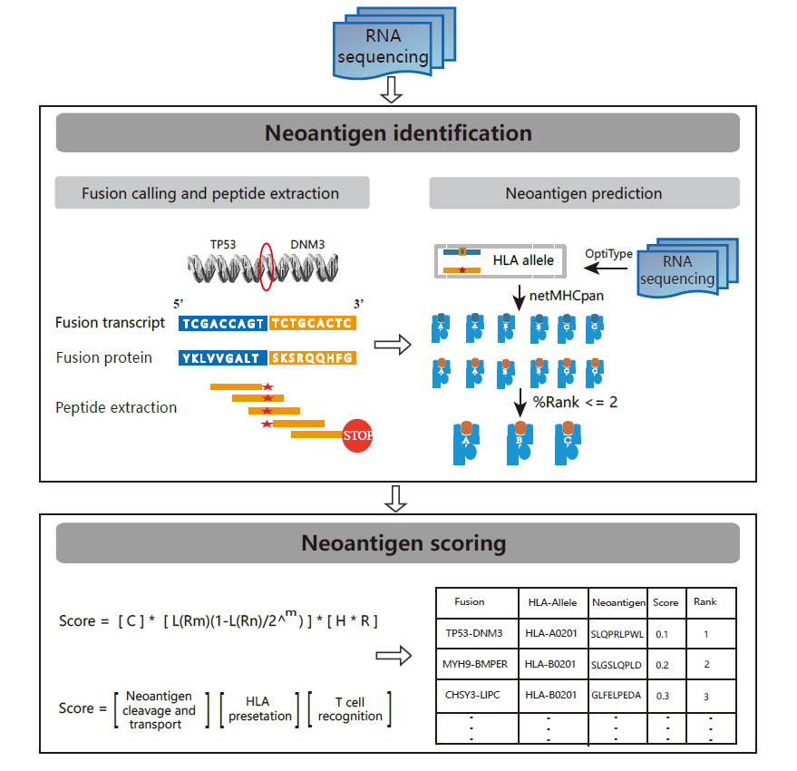

# neoFusion: predict fusion neoantigen and assess immunogenecity  
  
Fusion, an important class of somatic mutation, is an ideal source of tumor-derived neoantigens for the capability of creating open reading frame. In this study, the first one-top pipeline for identifying and prioritizing fusion neoantigen are presented.            
     
## Dependencies   

#### Required software:  
* [NetMHCpan 4.0](http://www.cbs.dtu.dk/cgi-bin/nph-sw_request?netMHCpan)
* [OptiType](https://github.com/FRED-2/OptiType)
* [netchop](http://www.cbs.dtu.dk/cgi-bin/nph-sw_request?netchop)
* [STAR-Fusion](https://github.com/STAR-Fusion/STAR-Fusion)
* [ pepmatch ]  module of MuPeXI, for convenience, we provide this binary tool.

#### Python2 package     
     xgboost
     biopython
     scikit-learn
     pandas
     numpy
     subprocess
     multiprocessing
     pickle   

#### reference  
     download from (https://data.broadinstitute.org/Trinity/CTAT_RESOURCE_LIB/)    
     please refer to STAR-Fusion for more detail.    
     All the other needed materials can be found at data directory   

## Installation   
#### Install via Docker   
Docker image of neoFusion is available at https://hub.docker.com/r/weizhiting/neofusion/.   
if you have docker installed, you can pull the image like so:  
docker pull weizhiting/neofusion

#### Install from source   
To install  neoFusion, you just need download neoFusion.py and all the described dependencies.

## Usage    

To run neoFusion, edit the software path in neoFusion to the right path in your environment.   

## Contact   

Zhiting Wei   
1632738@tongji.edu.cn

Biological and Medical Big data Mining Lab    
Tongji University    
Shanghai, China.

## neoFusion flowchart

